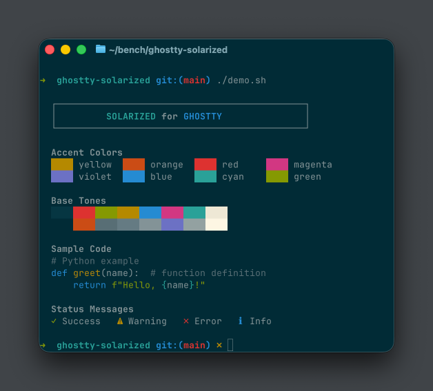
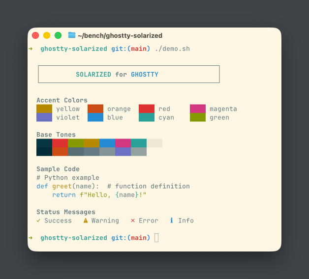

# Solarized Theme for Ghostty

Precision color scheme for [Ghostty](https://ghostty.org) terminal emulator, based on [Solarized](https://ethanschoonover.com/solarized/) by Ethan Schoonover.

## Screenshots

### Solarized Dark



### Solarized Light



## Installation

### Option 1: Copy to themes directory

```bash
# Create themes directory if it doesn't exist
mkdir -p ~/.config/ghostty/themes

# Copy theme files
cp themes/solarized-dark themes/solarized-light ~/.config/ghostty/themes/
```

Then add to your Ghostty config (`~/.config/ghostty/config`):

```
theme = solarized-dark
```

Or for automatic light/dark mode switching:

```
theme = dark:solarized-dark,light:solarized-light
```

### Option 2: Use absolute path

Reference the theme file directly:

```
theme = /path/to/ghostty-solarized/themes/solarized-dark
```

## Demo

Run the demo script to preview the color palette:

```bash
./demo.sh
```

## Repository Structure

```
ghostty-solarized/
├── themes/
│   ├── solarized-dark     # Dark background theme
│   └── solarized-light    # Light background theme
├── screenshots/
│   ├── solarized-dark.png
│   └── solarized-light.png
├── demo.sh                # Color palette demo script
└── README.md
```

## Color Palette

| Name    | Hex     | Role                          |
|---------|---------|-------------------------------|
| base03  | #002b36 | Dark background               |
| base02  | #073642 | Dark background highlights    |
| base01  | #586e75 | Comments / secondary content  |
| base00  | #657b83 | Light mode body text          |
| base0   | #839496 | Dark mode body text           |
| base1   | #93a1a1 | Emphasized content            |
| base2   | #eee8d5 | Light background highlights   |
| base3   | #fdf6e3 | Light background              |
| yellow  | #b58900 | Accent                        |
| orange  | #cb4b16 | Accent                        |
| red     | #dc322f | Accent                        |
| magenta | #d33682 | Accent                        |
| violet  | #6c71c4 | Accent                        |
| blue    | #268bd2 | Accent                        |
| cyan    | #2aa198 | Accent                        |
| green   | #859900 | Accent                        |

## Credits

- [Solarized](https://github.com/altercation/solarized) by Ethan Schoonover
- [Ghostty](https://github.com/ghostty-org/ghostty) terminal emulator

## License

MIT License (same as Solarized)
